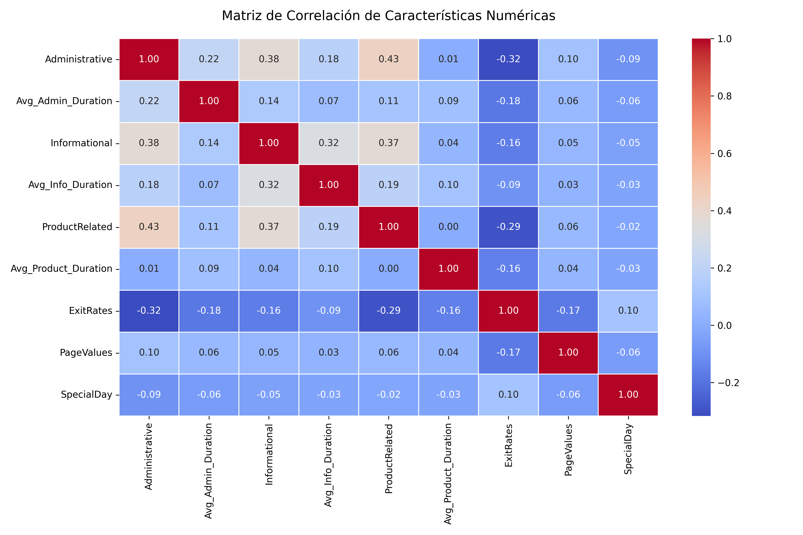
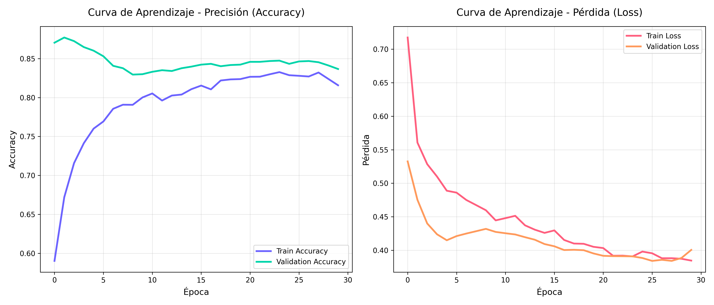
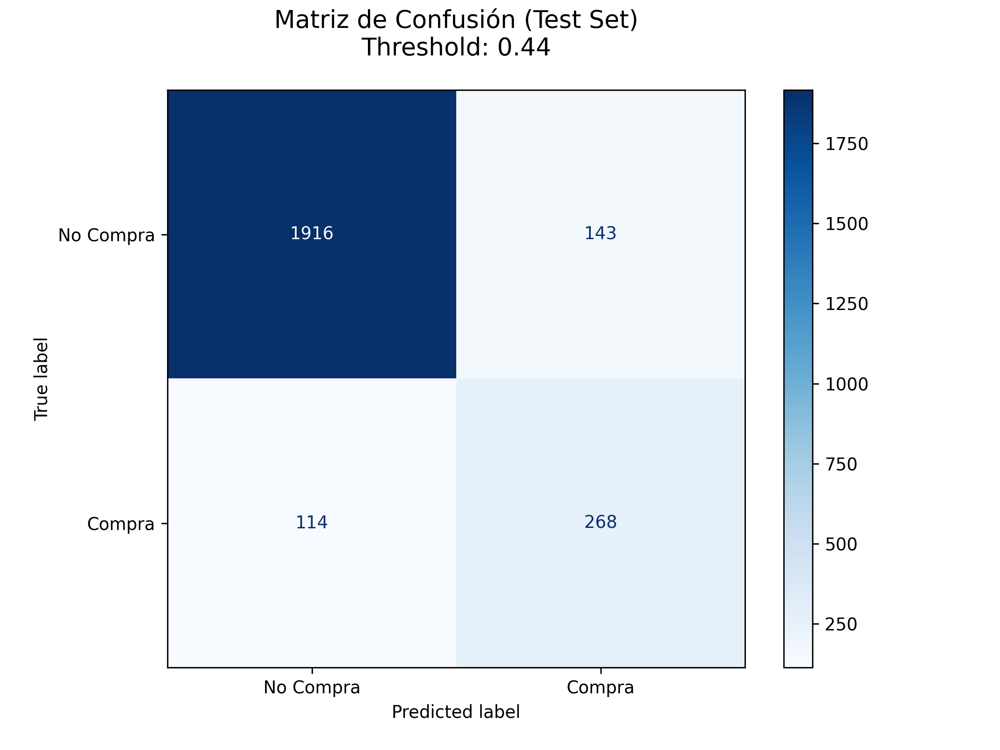

# Sistema Predictivo de Intención de Compra para E-Commerce

> **Informe técnico del pipeline de Machine Learning y documentación de la API REST**

---

## Tabla de Contenidos

1. [Descripción del Proyecto](#1-descripción-del-proyecto)
2. [Estructura del Repositorio](#2-estructura-del-repositorio)
3. [Pipeline de Data Science](#3-pipeline-de-data-science)
   - [3.1 Descripción del Dataset](#31-descripción-del-dataset)
   - [3.2 Análisis Exploratorio (EDA)](#32-análisis-exploratorio-eda)
   - [3.3 Limpieza e Imputación](#33-limpieza-e-imputación)
   - [3.4 Desbalance de Clases](#34-desbalance-de-clases)
   - [3.5 Preprocesamiento e Ingeniería de Características](#35-preprocesamiento-e-ingeniería-de-características)
   - [3.6 Arquitectura del Modelo](#36-arquitectura-del-modelo)
   - [3.7 Hyperband Tuning](#37-hyperband-tuning)
   - [3.8 Métricas de Rendimiento](#38-métricas-de-rendimiento)
4. [API REST](#4-api-rest)
   - [4.1 Endpoints](#41-endpoints)
   - [4.2 Esquema de Request](#42-esquema-de-request)
   - [4.3 Esquema de Response](#43-esquema-de-response)
   - [4.4 Ejemplos con Postman / curl](#44-ejemplos-con-postman--curl)
5. [Decisiones de Diseño](#5-decisiones-de-diseño)

---

## 1. Descripción del Proyecto

Este sistema predice si un usuario de e-commerce realizará una compra durante su sesión de navegación, utilizando señales de comportamiento capturadas en tiempo real. El departamento de IT puede consultar la API REST antes de renderizar la página de producto para decidir dinámicamente qué artículos mostrar.

**Stack tecnológico:**
- **Modelo:** Keras (TensorFlow 2.18 CPU) + Keras Tuner (Hyperband)
- **Pipeline de datos:** scikit-learn `ColumnTransformer` + Pandas
- **API:** FastAPI + Uvicorn (Compatible nativamente con Vercel)
- **Datos:** UCI Online Shoppers Purchasing Intention Dataset

---

## 2. Estructura del Repositorio

El proyecto fue optimizado en una arquitectura de archivos simplificada:

```text
ecommerce-purchase-intent/
├── data/
│   └── dataset_shop.csv            # Dataset (12,330 sesiones)
├── train.py                        # Script principal: Pipeline + Modelo + Hyperband
├── generate_plots.py               # Script para generar las gráficas del informe
├── api/
│   └── index.py                    # FastAPI app (Entrypoint de Vercel)
├── artifacts/
│   ├── model.keras                 # Keras SavedModel entrenado
│   ├── preprocessor.pkl            # Pipeline de scikit-learn serializado
│   ├── model_info.json             # Hiperparámetros óptimos y threshold
│   ├── correlacion.png             # Gráficas generadas
│   ├── matriz_confusion.png
│   └── curva_aprendizaje.png
├── vercel.json                     # Configuración de despliegue Serverless
├── requirements.txt
└── README.md                       # Este archivo
```

---

## 3. Pipeline de Data Science

### 3.1 Descripción del Dataset

El **UCI Online Shoppers Purchasing Intention Dataset** contiene 12,330 sesiones de usuarios en una tienda en línea. Cada fila representa una sesión única.

| # | Columna | Tipo | Descripción |
|---|---------|------|-------------|
| 1 | `Administrative` | Numérico | Páginas administrativas visitadas |
| 2 | `Administrative_Duration` | Numérico | Tiempo total en páginas admin (s) |
| 3 | `Informational` | Numérico | Páginas informacionales visitadas |
| 4 | `Informational_Duration` | Numérico | Tiempo total en páginas info (s) |
| 5 | `ProductRelated` | Numérico | Páginas de producto visitadas |
| 6 | `ProductRelated_Duration` | Numérico | Tiempo total en páginas de producto (s) |
| 7 | `BounceRates` | Numérico | Tasa de rebote promedio (0–1) |
| 8 | `ExitRates` | Numérico | Tasa de salida promedio (0–1) |
| 9 | `PageValues` | Numérico | Valor promedio de página visitada |
| 10 | `SpecialDay` | Numérico | Proximidad a fecha festiva (0–1) |
| 11 | `Month` | Categórico | Mes de la sesión |
| 12 | `OperatingSystems` | Categórico (int) | Código del SO |
| 13 | `Browser` | Categórico (int) | Código del navegador |
| 14 | `Region` | Categórico (int) | Código de región geográfica |
| 15 | `TrafficType` | Categórico (int) | Tipo de fuente de tráfico |
| 16 | `VisitorType` | Categórico | `Returning_Visitor`, `New_Visitor`, `Other` |
| 17 | `Weekend` | Booleano | True si es fin de semana |
| 18 | `Revenue` | **Target** | True si hubo compra (variable objetivo) |

### 3.2 Análisis Exploratorio (EDA)

Hallazgos clave del EDA:
- **`PageValues`** es el predictor más fuerte: sesiones con compra tienen valores significativamente altos.
- Se encontraron **125** entradas *repetidas*, y a pesar de tener un dataset muy sesgado a la "No Compra", ya que no se posee una medida de ID u otra forma que permita garantizar la independencia de estas entradas entre sí, se tomó la decisión de descartarlas para evitar el sesgo hacia *features* de esa forma, y así garantizar un mejor entrenamiento y clasificación con datos reales.
- **`BounceRates`** y **`ExitRates`** correlacionan negativamente con compra (usuarios que rebotan no compran) y son altamente redundantes entre sí.

### 3.3 Limpieza e Imputación

| Problema | Estrategia | Justificación |
|----------|------------|---------------|
| Valores faltantes numéricos | `SimpleImputer(strategy="median")` | La mediana es robusta a outliers |
| Valores faltantes categóricos | `SimpleImputer(strategy="most_frequent")` | Preserva la distribución modal |
| Codificación de `Weekend`/`Revenue` | Mapeo a booleanos | Conversión directa a enteros (0/1) |

### 3.4 Desbalance de Clases

El dataset presenta un desbalance significativo:
- **~85%** de sesiones: NO compra (`Revenue = False`)
- **~15%** de sesiones: SÍ compra (`Revenue = True`)

**Estrategia adoptada: `class_weight="balanced"`**
Se calculan pesos de clase inversamente proporcionales a la frecuencia usando `compute_class_weight`. Esto penaliza fuertemente los errores en la clase minoritaria (compra) durante el entrenamiento, obligando a la red a enfocarse en los compradores.

### 3.5 Preprocesamiento e Ingeniería de Características

Para evitar que la IA memorizara ruido y redundancias, se aplicó una etapa de *Feature Engineering* matemática:
1. **Multicolinealidad:** Se eliminó `BounceRates`, ya que es redundante con `ExitRates`.
2. **Derivación de Profundidad:** Se crearon las métricas `Avg_Admin_Duration`, `Avg_Info_Duration` y `Avg_Product_Duration` (dividiendo el tiempo total entre las páginas visitadas). Las duraciones crudas totales fueron eliminadas.

El preprocesador de scikit-learn aplica `StandardScaler` a los numéricos y `OneHotEncoder` a los categóricos, guardándose en `artifacts/preprocessor.pkl`.



### 3.6 Arquitectura del Modelo

El modelo es una red neuronal construida dinámicamente:
- **Capa de entrada:** Fija al tamaño exacto de las *features* procesadas.
- **Capas intermedias:** Añadidas iterativamente. Se utiliza `BatchNormalization` y `Dropout(0.2)` para evitar el sobreajuste.
- **Salida:** Una neurona Densa con activación `sigmoid` para predicción binaria.

### 3.7 Hyperband Tuning

Se utilizó Keras Tuner para optimizar la arquitectura.
- **Objetivo:** Minimizar la pérdida en validación (`val_loss`) en lugar del Accuracy. Para datos desbalanceados, el error logarítmico penaliza mejor los errores sutiles.
- **Configuración:** `max_epochs=50`, `batch_size=64`, `factor=3`, `EarlyStopping(patience=10)`.


*(Nota: Las fluctuaciones son esperadas y demuestran las correcciones agresivas realizadas por un dataset desbalanceado).*

### 3.8 Métricas de Rendimiento

El modelo define su umbral (Threshold) dinámicamente probando múltiples puntos de corte y seleccionando el que maximiza el **F1-Score**.



---

## 4. API REST

### 4.1 Endpoints

| Método | Ruta | Descripción |
|--------|------|-------------|
| `GET` | `/` | Health check — estado del modelo |
| `POST` | `/predict` | **Endpoint principal** — retorna predicción JSON |
| `GET` | `/docs` | Swagger UI interactiva (Interfaz visual de prueba) |

### 4.2 Esquema de Request

`POST /predict` — `Content-Type: application/json`

```json
{
  "Administrative": 3,
  "Administrative_Duration": 120.5,
  "Informational": 1,
  "Informational_Duration": 30.0,
  "ProductRelated": 15,
  "ProductRelated_Duration": 850.2,
  "BounceRates": 0.02,
  "ExitRates": 0.04,
  "PageValues": 25.3,
  "SpecialDay": 0.0,
  "Month": "Nov",
  "OperatingSystems": 2,
  "Browser": 1,
  "Region": 3,
  "TrafficType": 2,
  "VisitorType": "Returning_Visitor",
  "Weekend": false
}
```

### 4.3 Esquema de Response

```json
{
  "clasificacion": "compra",
  "probabilidad": 0.8734,
  "mensaje": "El usuario presenta un 87.34% de probabilidades de hacer la compra, altamente probable."
}
```

### 4.4 Ejemplos con Postman / curl

**Predicción interactiva desde CLI:**
```bash
curl -X POST http://localhost:8000/predict \
  -H "Content-Type: application/json" \
  -d '{
    "Administrative": 3, "Administrative_Duration": 120.5,
    "Informational": 1, "Informational_Duration": 30.0,
    "ProductRelated": 15, "ProductRelated_Duration": 850.2,
    "BounceRates": 0.02, "ExitRates": 0.04,
    "PageValues": 25.3, "SpecialDay": 0.0,
    "Month": "Nov", "OperatingSystems": 2, "Browser": 1,
    "Region": 3, "TrafficType": 2,
    "VisitorType": "Returning_Visitor", "Weekend": false
  }'
```

---

## 5. Decisiones de Diseño

| Decisión | Razón de la elección |
|----------|----------------------|
| **Hyperband** sobre GridSearch | 5× más eficiente computacionalmente; aborta pruebas mediocres temprano. |
| **`class_weight`** sobre SMOTE | No modifica ni inyecta datos falsos al dataset original; penaliza a nivel de entropía. |
| **Tiempo Promedio por Página** | Destruye la altísima colinealidad natural entre Páginas Totales vs Minutos Totales. |
| **Minimizar `val_loss`** | Obliga al modelo a priorizar la reducción de errores en lugar del *Accuracy* falso por desbalance. |
| **FastAPI + Swagger** | Documentación `/docs` generada en vivo con inyección de datos de prueba, sin necesidad de hacer frontend. |
| **Dependencias** | Se dividieron las dependencias en `requirements.txt` y `requirements-train.txt` para poder acomodar mejor el despliegue en *vercel*. |
